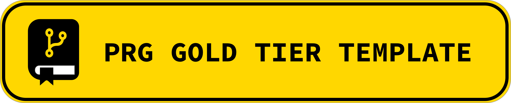
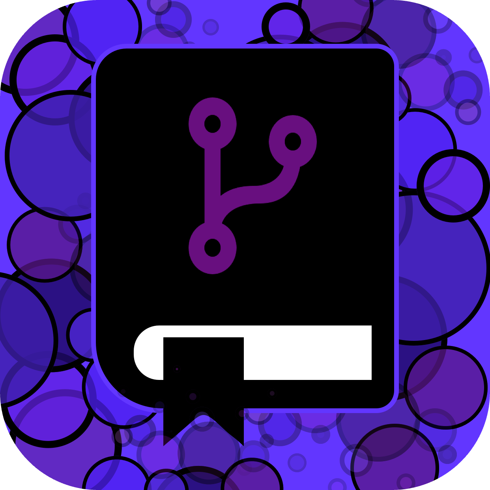

<!-- Begin README -->

[](https://github.com/scottgriv/PRG-Personal-Repository-Guidelines)

<p align="center">
    <a href="https://daringfireball.net/projects/markdown/"></a>
    <br>
    <a href="https://github.com/scottgriv"></a>
    <a href="mailto:scott.grivner@gmail.com"></a>
    <a href="https://www.buymeacoffee.com/scottgriv"></a>
    <br>
    <a href="https://github.com/scottgriv/PRG-Personal-Repository-Guidelines/releases" target="_blank"></a>
    <a href="https://prgoptimized.com" target="_blank">
    </a>
    <a href="https://prgportfolio.com"></a>
</p>

---------------

<h1 align="center"> PRG Gold Tier Template</img></h1>

<!-- Remove this block before you commit your README - this is for template reference purposes only -->
<div align="center">
<table>
    <tr>
        <td>
            <div align="center">
                <h3 align="center">What is this Template for?</h3>
                <table>
                    <tr>
                        <td align="center">
                            <a href="https://github.com/scottgriv/PRG-Personal-Repository-Guidelines"></a>
                            <br>
                            <p>This Template is part of the <br><b><a href="https://github.com/scottgriv/PRG-Personal-Repository-Guidelines">Personal Repository Guidelines (PRG)</a></b><br> repository categorization system.</p>
                            <b>Visit the PRG Repository<br>to get started with PRG today.</b>
                        </td>
                    </tr>
                    <tr>
                        <td align="center">
                            <a href="https://prgoptimized.com"></a>
                            <br>
                            <p>Visit <b><a href="https://prgoptimized.com">The Official PRG Website</a></b><br> for more information.</p>
                            <b>Submit a pull request to add your<br>PRG Portfolio to the PRG Showcase.</b>
                        </td>
                    </tr>
                </table>
            </div>
        </td>
        <td>
            <div align="center">
                <h3 align="center">Looking for other Tier Templates?</h3>
                <table>
                    <tr>
                        <td align="center">
                            <a href="https://github.com/scottgriv/PRG-Platinum-Tier-Template"></a>
                            <br>
                            <p><b><a href="https://github.com/scottgriv/PRG-Platinum-Tier-Template">Platinum Tier Template</a></b></p>
                        </td>
                        <td align="center">
                        <p align="center"><i>You are here</i></p>
                            <a href="https://github.com/scottgriv/PRG-Gold-Tier-Template"></a>
                            <br>
                            <p><b><a href="https://github.com/scottgriv/PRG-Gold-Tier-Template">Gold Tier Template</a></b></p>
                        </td>
                    </tr>
                    <tr>
                        <td align="center">
                            <a href="https://github.com/scottgriv/PRG-Silver-Tier-Template"></a>
                            <br>
                            <p><b><a href="https://github.com/scottgriv/PRG-Silver-Tier-Template">Silver Tier Template</a></b></p>
                        </td>
                        <td align="center">
                            <a href="https://github.com/scottgriv/PRG-Bronze-Tier-Template"></a>
                            <br>
                            <p><b><a href="https://github.com/scottgriv/PRG-Bronze-Tier-Template">Bronze Tier Template</a></b></p>
                        </td>
                    </tr>
                </table>
            </div>
        </td>
    </tr>
</table>
</div>
<!-- End Remove Block -->

> [!NOTE]
> I will be using examples from my project [River Charts](https://github.com/scottgriv/River-Charts) throughout this `README` template.

- The description should be a short paragraph describing what your project is and what it does.
- This should be the first section after the badges.
    - e.g. "A Python, Django, Plotly, and Pandas web application that visualizes river data pulled using an API from the United States Geological Survey (USGS)."
- Add **screenshots** of your project below the description and throughout the rest of the README as needed.
    - This is optional, but highly recommended especially for **Gold** projects.
    - Animations in the form of GIFs are also a great way to showcase your project.

---------------

## Table of Contents

- [Features](#features)
- [Background Story](#background-story)
- [Definitions](#definitions)
- [Getting Started](#getting-started)
    - [Dependencies](#dependencies)
    - [Configuration](#configuration)
    - [Installation](#installation)
    - [Deployment](#deployment)
- [Specific Project Sections](#specific-project-sections)
- [What's Inside?](#whats-inside)
- [Closing](#closing)
- [What's Next?](#whats-next)
- [Project](#project)
- [Contributing](#contributing)
- [Resources](#resources)
- [License](#license)
- [Credits](#credits)

## Features

This section should contain a list of features that your project has.

## Background Story

The background story should be a short paragraph describing why you created the project and what inspired you to create it.

## Definitions

This section should contain a list of definitions for any terms that you use throughout your `README`.
- This is especially useful for technical terms that the reader may not be familiar with.
- e.g. Here are some definitions to help you understand the terminology used in this document:
    - <ins><b>USGS</b></ins>: The United States Geological Survey. The USGS is a science organization that provides impartial information on the health of our ecosystems and environment, the natural hazards that threaten us, the natural resources we rely on, the impacts of climate and land-use change, and the core science systems that help us provide timely, relevant, and useable information.
        - [USGS](https://www.usgs.gov/)
    - <ins><b>Gage Height</b></ins>: The height of the water surface above the gage datum (zero point). Gage height is often used interchangeably with the more general term, stage, although gage height is more appropriate when used with a gage reading. Stage is more appropriate when used with a recorded or calculated gage height.
        - [Gage Height](https://waterdata.usgs.gov/blog/gage_height/)

## Getting Started

This section should contain a list of steps to get your project up and running.
- You can break this section down into further subsections if you want (such as below: Dependencies, Configuration, Running Locally, Deployment, etc.).
- Otherwise, you can just include a list of steps to get your project up and running under Getting Started.

### Dependencies

- This section should contain a list of dependencies for your project.

### Configuration

- This section should contain a list of steps to configure your project.

### Installation

- This section should contain a list of steps to install your project.
- Utilize code blocks to show the commands needed to run your project.
- e.g.
    1. Clone this repository.
    2. Create a virtual environment: `python -m venv venv`.
    3. Install the dependencies.
    4. Run the application: 
        ```bash
        python manage.py runserver
        ```

### Deployment

- This section should contain a list of steps to deploy your project.

## What's Inside?

This section should contain a list of files and folders in your project and what each one does.
- Generally, you should only list the main files and folders in your project, not every single file.
- Use a **tree diagram** to show the relationship between files and folders:
- e.g. 
    ```bash
    ├── README.md # This file.
    ├── config.py # A file that contains sensitive information (excluded from this repository).
    ├── manage.py # A command-line utility that lets you interact with this Django project in various ways.
    ├── requirements.txt # A list of Python packages required to run this project.
    ├── static # A directory for static files that are used in this Django project.
    │   ├── css # A directory for CSS files.
    │   │   └── styles.css # A CSS file that contains the styles for the application.
    │   ├── data # A directory for data files.
    │   │   └── river_charts.csv # A CSV file that contains the float dates for the application.
    │   └── images # A directory for image files.
    ├── templates # A directory for HTML templates.
    │   └── river_charts # A directory for HTML templates specific to the river_charts app.
    │       ├── error.html # An HTML template that displays an error message.
    │       └── index.html # An HTML template that displays the application.
    ├── views.py # A file that contains the application logic.
    ├── VERSION # A file that contains the current version of the application.
    ├── LICENSE # A file that contains the license for this project.
    └── CREDITS # A file that contains the credits for this project.
    ```

## Specific Project Sections

There should be a number of sections here that correspond to important aspects of your project.
- Do not name this section "Specific Project Sections".
- e.g. "API", "Database", "Deployment", "Testing", etc.

## Closing

This section should contain a short paragraph thanking the reader for taking the time to read your `README`.

## What's Next?

This section should contain a list of features you plan to add to your project in the future.

e.g.
- [X] Release v1.0.0 of **River Charts**.
- [ ] Enhance API call performance.

## Project

This section should contain a link to the project's website or a link to the project's repository.

## Contributing

This section should contain a list of steps for contributing to your project.
- You can also include a link to a separate `CONTRIBUTING.md` file.
    - e.g. [CONTRIBUTING.md](./.github/CONTRIBUTING.md)
    - Use a contributing generator like [Contributing-Gen](https://generator.contributing.md/#) to create your `CONTRIBUTING.md` file.

## Resources

This section should contain a list of resources that you used to create your project.

Below are some external resources I found helpful when creating **My Project**:

- [Python](https://www.python.org/) - An interpreted, high-level and general-purpose programming language.
- [Plotly](https://plotly.com/python/) - A Python graphing library that makes interactive, publication-quality graphs online.
- [Django](https://www.djangoproject.com/) - A high-level Python Web framework that encourages rapid development and clean, pragmatic design.
- [Pandas](https://pandas.pydata.org/) - A fast, powerful, flexible and easy to use open source data analysis and manipulation tool, built on top of the Python programming language.

## License

This section should contain the license for your project.

This project is released under the terms of the **MIT License**, which permits use, modification, and distribution of the code, subject to the conditions outlined in the license.
- The [MIT License](https://choosealicense.com/licenses/mit/) provides certain freedoms while preserving rights of attribution to the original creators.
- For more details, see the [LICENSE](LICENSE) file in this repository. in this repository.

## Credits

**Author:** [Scott Grivner](https://github.com/scottgriv) <br>
**Email:** [scott.grivner@gmail.com](mailto:scott.grivner@gmail.com) <br>
**Website:** [scottgrivner.dev](https://www.scottgrivner.dev) <br>
**Reference:** [Main Branch](https://github.com/scottgriv/PRG-Gold-Tier-Template) <br>

---------------

<div align="center">
    <a href="https://github.com/scottgriv/PRG-Gold-Tier-Template" target="_blank">
        
    </a>
</div>

<!-- End README -->
