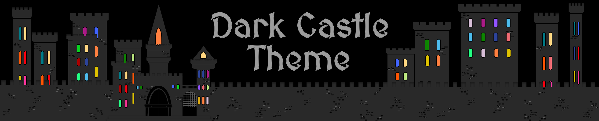
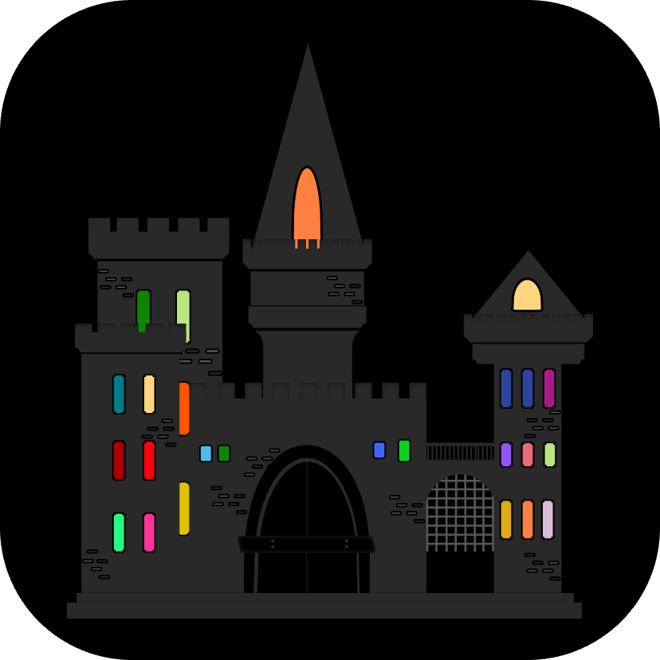

<!-- Begin README -->

    <a href="https://darkcastle.netlify.app" target="_blank">
         <!-- Add a specific width/height for your icon here, ex. width="150" height="150"-->
    </a>

 

    
    
    
     
    

---

<h1 align="center">🏰 Dark Castle Theme 🌲</h1>
<h3 align="center">One theme to rule them all...</h3>

**Dark Castle** is a vibrantly elegant dark theme available for multiple platforms. Inspired by the timeless beauty and mystery of medieval castles, this theme combines rich, deep colors with a clean and modern design. It's perfect for developers who prefer a dark environment that reduces eye strain and enhances code readability.

Currently, **Dark Castle** is supported for the following platforms (IDEs, Text Editiors, Terminals, etc.):

0. [Dark Castle Website](https://darkcastle.netlify.app)
1. [Visual Studio Code](https://github.com/scottgriv/Dark-Castle-VSCode)
2. [Notepad++](https://github.com/scottgriv/Dark-Castle-Notepad-Plus-Plus)
3. [Xcode](https://github.com/scottgriv/Dark-Castle-Xcode)
4. [Obsidian](https://github.com/scottgriv/Dark-Castle-Obsidian)
5. [Sublime](https://packagecontrol.io/packages/Dark%20Castle%20Color%20Scheme)
6. [iTerm 2](https://github.com/scottgriv/Dark-Castle-iTerm)
7. [Warp](https://github.com/scottgriv/Dark-Castle-Warp)
8. [MySQL Workbench](https://github.com/scottgriv/Dark-Castle-MySQL-Workbench)
9. [BBEdit](https://github.com/scottgriv/Dark-Castle-BBEdit)
10. [Terminal.app](https://github.com/scottgriv/Dark-Castle-Terminal-App)
11. [Windows Terminal](https://github.com/scottgriv/Dark-Castle-Windows-Terminal)
12. [SwiftUI](https://github.com/scottgriv/Dark-Castle-SwiftUI)
13. [Sketch](https://github.com/scottgriv/Dark-Castle-Sketch)
14. [Figma](https://github.com/scottgriv/Dark-Castle-Figma)
15. [Wallpaper](https://github.com/scottgriv/Dark-Castle-Wallpaper)

---

## Table of Contents

- [Features](#features)
- [Background Story](#background-story)
- [Installation](#installation)
- [Color Palette](#color-palette)
- [Team](#team)
- [Contributing](#contributing)
- [Changelog](#changelog)
- [Resources](#resources)
- [Credits](#credits)
- [License](#license)

## Features

- **Subtle Background:** A dark, muted background that provides the perfect contrast for your code.
- **Vivid Syntax Highlighting:** Carefully chosen colors for syntax highlighting that enhance readability and focus.
- **Elegant UI Elements:** Thoughtfully designed UI components that blend seamlessly with the overall aesthetic.
- **Enhanced Visibility:** Improved visibility for selected text, active line highlighting, and matching brackets.

Whether you're coding late into the night or simply prefer a dark interface, **Dark Castle** offers a visually appealing and comfortable experience.

## Background Story

Back in 2013, I ([Scott Griv](https://github.com/scottgriv)) began to grow tired of the simple dark color themes provided out of the box with my [IDE](https://en.wikipedia.org/wiki/Integrated_development_environment) or [Text Editor](https://en.wikipedia.org/wiki/Text_editor) at the time. I decided to take a crack at building my own theme. The first platform I built it on was [Text Wrangler](https://www.barebones.com/products/textwrangler/), now migrated to [BBEdit](https://www.barebones.com/products/bbedit/index.html), and that original theme can be found [here](https://github.com/scottgriv/Dark-Castle-BBEdit).

I was inspired to make this theme by a number of things, including video games like [Dwarf Fortress](https://en.wikipedia.org/wiki/Dwarf_Fortress), [Minecraft](https://en.wikipedia.org/wiki/Minecraft), and [Warcraft 3](https://en.wikipedia.org/wiki/Warcraft_III:_Reign_of_Chaos). Books and movies such as [The Lord of the Rings](https://en.wikipedia.org/wiki/The_Lord_of_the_Rings), [The Hobbit](https://en.wikipedia.org/wiki/The_Hobbit), [Vikings](<https://en.wikipedia.org/wiki/Vikings_(TV_series)>), and [Game of Thrones](https://en.wikipedia.org/wiki/Game_of_Thrones), also influenced its design. Additionally, historical events and archaeological discoveries played a significant part in shaping the theme. In particular, the rich history and majestic architecture of Scottish castles like [Edinburgh Castle](https://en.wikipedia.org/wiki/Edinburgh_Castle) fueled my imagination and contributed to the overall aesthetic of the theme.

Yeah... a lot of nerdy stuff. I know 😆

For over a decade, I hoarded this theme for myself, but now I've decided to give it to the world and open source it, which brings you here right now.

I started out with some of my most used platforms and hope to add more over time, and maybe get some help from the OSS community to help me create more, if others end up enjoying it as much as I have. Enjoy! 😀

## Installation

1. Reference the [Themes](themes) folder for each platforms repository (or by clicking the links above).
2. Follow the **Install** file (`INSTALL.md`) in the root of the repository for specific instructions for said platform.
3. Enjoy!

## Color Palette

These are the core colors used for backgrounds, accents, syntax, etc.

| Palette                                     | Hex       | RGB             | HSL             | Picker                                                                 |
| ------------------------------------------- | --------- | --------------- | --------------- | ---------------------------------------------------------------------- |
| Background                                  | `#000000` | `0, 0, 0`       | `0° 0% 0%`      |       |
| Code Blocks                                 | `#1A1A1A` | `26, 26, 26`    | `0° 0% 10%`     |      |
| Current Line Highlight                      | `#292929` | `41, 41, 41`    | `0° 0% 16%`     |     |
| Word Highlight                              | `#575757` | `87, 87, 87`    | `0° 0% 34%`     |   |
| Borders, Icons, & Menu Text                 | `#9C9C9C` | `156, 156, 156` | `0° 0% 61%`     |          |
| Punctuation                                 | `#FFFFFF` | `255, 255, 255` | `0° 0% 100%`    |       |
| Errors                                      | `#EF6B73` | `239, 107, 115` | `356° 79% 68%`  |           |
| Accent & Operators                          | `#FF8040` | `255, 128, 64`  | `20° 100% 63%`  |           |
| Foreground, Plain Text, Brackets, & Symbols | `#FFD580` | `255, 213, 128` | `42° 100% 75%`  |       |
| Headings                                    | `#BAE67E` | `186, 230, 126` | `79° 66% 70%`   |         |
| Tags & REGEX                                | `#4DBCED` | `77, 188, 237`  | `194° 79% 62%`  |             |
| Strings                                     | `#FF000F` | `255, 0, 15`    | `0° 100% 50%`   |          |
| Classes & Words                             | `#FF5503` | `255, 85, 3`    | `19° 100% 51%`  |          |
| Variables & Characters                      | `#08D220` | `8, 210, 32`    | `127° 93% 43%`  |        |
| URLs                                        | `#4164FF` | `65, 100, 255`  | `227° 100% 63%` |             |
| Numbers                                     | `#9354FF` | `147, 84, 255`  | `264° 100% 67%` |          |
| Comments                                    | `#0D8501` | `13, 133, 1`    | `116° 99% 26%`  |         |
| Preprocessor                                | `#007B88` | `0, 123, 136`   | `186° 100% 27%` |     |
| Horizontal Rule                             | `#2D449B` | `45, 68, 155`   | `228° 56% 39%`  |  |
| Functions & Keywords                        | `#AA1B86` | `170, 27, 134`  | `315° 73% 39%`  |        |

> Reference the [Full Color Palette](./docs/PALETTE.md#full-color-palette) for the names used for the colors above and lesser colors not listed as well.
> You can also find other specific color palettes here as well.

## Team

**Dark Castle** is a project created by [Scott Griv](https://github.com/scottgriv/) with the help of [Anya E.](https://github.com/anyaenko/).

- Each theme has its maintainer listed in the Team section of its `README`.

|  |  |
| ---------------------------------------------------------------------------------------- | ----------------------------------------------------------------------------------- |
| [Scott Griv](https://github.com/scottgriv)                                               | [Anya E.](https://github.com/anyaenko)      

> [!NOTE]
> In the future, if the project grows, we may move the theme repos to its own organization and give contributors the rights to maintain their submissions.

## Contributing

> "Are you going to support editor X?"

Hopefully! But, we'll need your help to accomplish that. Since you're already using app X, you're probably much more experienced in it than we are. So give it a try first!

> "How do I submit a new theme?"

If you would like to contribute to an existing platform theme or create a new **Dark Castle** theme for a missing platform:

- Please reference the [Contributing Guidelines](.github/CONTRIBUTING.md) file in this repository for more details.
- Consider joining our [GitHub Discussions](https://github.com/scottgriv/Dark-Castle-Theme/discussions).
- Check out our [GitHub Project](https://github.com/users/scottgriv/projects/14) to get a good understanding of where we're currently at with the overall project.

## Changelog

The **Changelog** is available in the `.github` folder in each theme's repository.

## Credits

View our [Credits](.github/CREDITS.md) file for a list of acknowledgements for this project.

## License

This project is released under the terms of the **MIT License**, which permits use, modification, and distribution of the code, subject to the conditions outlined in the license.

- The [MIT License](https://choosealicense.com/licenses/mit/) provides certain freedoms while preserving rights of attribution to the original creators.
- For more details and to understand all requirements and conditions, see the [License](LICENSE) file in this repository.

---

    

<!-- End README -->
